<h1 align="center">Hi, I'm Abizer 👋</h1>

<h3 align="center">
Full Stack Developer · Building practical products for real businesses
</h3>

  

  

  

  

  

---

## 💫 About Me

- 🎓 4th Year Information Technology student at **M. H. Saboo Siddik College of Engineering**
- 💼 Freelance **Full Stack Developer**
- 🛠️ I build and ship complete applications from **frontend → backend → database → deployment**
- 🤖 Interested in **IoT, Embedded Systems, AI/ML and intelligent automation**
- 🔧 Hands-on with **ESP32, Arduino, RFID, GPS and sensors**
- 🌱 Currently deepening my **backend development** skills
- ⚡ I prefer building **real, working products** over half-finished tutorials
- 🏆 Participated in **15+ hackathons and technical competitions**

---

## 🛠️ Tech Stack

### 💻 Programming

  

### 🌐 Full Stack Development

  

### 🤖 IoT & Embedded Systems

  

**ESP32 · Arduino · RFID · GPS · Sensors · Embedded Systems ·
Wireless Communication · Hardware–Software Integration**

### 🧠 AI / ML

**Machine Learning · Computer Vision · AI APIs · OpenAI**

### 🧰 Tools & Platforms

  

**ThingSpeak · REST APIs · JWT · PWA · Tailwind CSS**

---

# 🚀 Full-Stack & IoT Projects

### 🎓 Engineer Hub

**MERN · Role-Based Access Control · Production-Oriented**

A complete digital ecosystem for the Mumbai University engineering community — attendance
tracking with a 75%-eligibility calculator, a peer marketplace for buying/selling academic
projects, a freelancing board, study resources, placement tracking, results, and messaging,
all in one platform. Four roles (Student, Developer, Admin, Super Admin), each with its own
dashboard, plus rate limiting, input validation, audit logging, and a full moderation workflow.

🎥 [Demo Video](https://youtu.be/4-doqHUU-6A) · 💼 [LinkedIn Post](https://www.linkedin.com/posts/mr-abizer-saify-a3b936278_webdevelopment-fullstackdeveloper-mern-ugcPost-7492660713274892288-wlPy)

🔗 **GitHub:** [Engineer-Hub](https://github.com/ABIZER-web/Engineer-Hub)

---

### 🚆 SRLMS — Smart Railway Linen Management System

**RFID · Hardware + Software · React · Node.js · MongoDB**

RFID-based tracking for railway linen (bed sheets, blankets, pillows, towels) across its full
lifecycle — register → assign to a passenger's PNR → use → return → laundry → exit-gate
anti-theft detection → blacklist enforcement. Built in two parts: firmware for an RFID
reader/writer that stamps every item with a unique tag ID, and a role-based web app (coach
attendant / linen contractor / railway officer / passenger) that turns tag scans into a real
assignment and theft-detection workflow.

🎥 [Software Walkthrough](https://youtu.be/mjcnY59cm1c) · [Hardware Demo](https://www.youtube.com/watch?v=GXQk6SBdLHM)

🔗 **GitHub:** [SRLMS](https://github.com/ABIZER-web/SRLMS)

---

### 📦 ColdGuard — Smart Cold-Chain Delivery Box

**ESP32 · IoT · GPS · ThingSpeak · React Dashboard**

An ESP32-based delivery box that monitors temperature, humidity, lid tampering, and GPS
location in transit, streaming live telemetry to ThingSpeak — built to reduce spoilage and
prove a temperature-sensitive delivery was never opened in transit. Detects lid open/close
via reed switch, auto-starts a delivery timer, drives status LEDs and a buzzer, and shows
live status on an I2C LCD. A React dashboard reads the same channel live for seal status,
temperature/humidity charts, and GPS.

🎥 [Demo Video](https://youtube.com/shorts/U0rptEwfu7w?feature=share)

🔗 **GitHub:** [ColdGuard](https://github.com/ABIZER-web/ColdGuard)

---

### 🚦 Punishing Signal — Smart Traffic Control

**Arduino · FFT Acoustic Analysis · Emergency Vehicle Pre-emption**

An Arduino-powered smart traffic light that penalizes unnecessary horn-honking at red/yellow
signals while automatically granting emergency vehicles priority green-light passage — using
Fast Fourier Transform acoustic analysis to tell a siren apart from ordinary horn noise.
Developed at M. H. Saboo Siddik College of Engineering.

🎥 [Demo Video](https://youtube.com/shorts/FMslKyPix5k?feature=share)

🔗 **GitHub:** [Punishing-Signal](https://github.com/ABIZER-web/Punishing-Signal)

---

# 🧠 AI / ML / Software Projects

### 🕳️ PotholeFix — AI Pothole Detection & Municipal Reporting

**YOLOv8 · React · Flask · MongoDB Atlas**

Real-time pothole detection from a phone/laptop camera using a custom-trained YOLOv8 model —
auto-captures GPS location, reverse-geocodes it, and routes the report to the correct civic
authority (BMC/TMC/NMMC) based on coordinates. Municipal admins get a live clustering map
dashboard, and repairs are verified by re-running the model on an "after" photo before a
report is marked resolved.

🔗 **GitHub:** [Pothole-Detection-Using-Yolo-V8](https://github.com/ABIZER-web/Pothole-Detection-Using-Yolo-V8)

---

### 🎫 ServeAI — Scan-to-Order Platform

**React · Node.js/Express · MongoDB · Google Gemini**

A full-stack scan-to-order platform for food trucks and small food businesses — customers
scan a table QR code, browse a live menu, build an order, and track it in real time. The
owner gets a full kitchen/business toolkit: live order management, sales analytics,
AI-assisted menu writing (Gemini), and full menu/pricing/store-status control, no code
required. Installable as a PWA.

🔗 **GitHub:** [serveAI](https://github.com/ABIZER-web/serveAI)

---

### 🏥 Sarthak Hospital — Queue Management System

**Node.js/Express · SQLite · Real-Time Queueing**

A real, runnable hospital queue system with proper auth and role enforcement — multiple
doctors per department each get their own auto-balanced queue, real slot-based appointment
booking with database-enforced locking (no double-bookings), a lab module, in-app
notifications, PDF prescriptions with doctor e-signatures, billing, and a doctor performance
dashboard — all built for a pilot deployment, not just a demo.

🔗 **GitHub:** [Hospital-Management-System](https://github.com/ABIZER-web/Hospital-Management-System)

---

### 🎥 Attend/OS — Face-Recognition Attendance

**Python · FastAPI · OpenCV · face_recognition · MongoDB · React**

Face-recognition attendance for classrooms and kiosks — walk up, get recognized, get marked
present. No cards, no manual roll call. Uses OpenCV and dlib-based face embeddings
(`face_recognition`) on a FastAPI backend, with a MongoDB store and a React/Vite frontend.

🔗 **GitHub:** [Attend-OS](https://github.com/ABIZER-web/Attend-OS)

---

### 📚 RAGent — AI Document Intelligence Assistant

**RAG · Embeddings · Cross-Encoder Re-ranking · Gemini**

Upload PDFs, DOCX, TXT, or CSV files and get accurate, source-grounded answers instead of
guesses — retrieval by embedding similarity, re-ranked with a cross-encoder, generated by
Gemini, with a groundedness/faithfulness check and page-level citations plus an optional
highlighted PDF preview. Multi-user accounts, streaming responses, and semantic caching.

🔗 **GitHub:** [RAGent](https://github.com/ABIZER-web/RAGent)

---

### 🤖 Jarvis AI — Local Voice Assistant

**Python · openWakeWord · faster-whisper · Windows 11**

A fully local, voice-controlled AI desktop assistant — wake-word detection ("Jarvis"),
on-device speech-to-text, a local AI brain, and real tool-use (opening apps, files, email,
screen control), plus a full dashboard UI. No cloud AI subscription required; everything
runs on-machine.

🔗 **GitHub:** [Jarvis](https://github.com/ABIZER-web/Jarvis)

---

### ⌨️ DevCommandHub

**React 18 · TypeScript · Tailwind v4 · Claude API**

AI-powered developer command reference — 10,000+ commands, searchable and explainable, with
an offline-capable PWA and a Claude-powered AI copilot for generating and explaining commands
on the fly.

🔗 **Live Demo:** [dev-command-hub.vercel.app](https://dev-command-hub.vercel.app/) · **GitHub:** [DevCommandHub](https://github.com/ABIZER-web/DevCommandHub)

---

🔗 Explore all repositories on **[GitHub](https://github.com/ABIZER-web?tab=repositories)**.

---

# 💼 Freelancing

I work with businesses to turn ideas and requirements into
working digital products.

### What I Build

- 🌐 Business websites
- ⚛️ React applications
- 🔧 Full-stack web applications
- 📊 Admin dashboards
- 🛒 Product/service platforms
- 📱 Responsive web applications
- 🔌 REST APIs
- 💬 WhatsApp integrations
- 🗄️ Database-backed applications
- 🚀 Deployment and production setup

---

# 🎓 Education

**Bachelor of Engineering — Information Technology**

**M. H. Saboo Siddik College of Engineering**  
Mumbai University  
**2023 – 2027**

CGPI: **6.53 / 10**

---

# 🏆 Certifications & Achievements

- ☁️ **AWS Certified Cloud Practitioner**
- ☁️ **AWS re/Start Graduate**
- 🔧 Arduino Training
- ☁️ Cloud Foundations
- 🤖 Machine Learning Foundations
- 🌐 MERN Stack Development
- 🏆 Participated in **15+ hackathons and technical competitions**
- 🏆 Smart India Hackathon — SIH
- 🏆 Quasar 4.0
- 🏆 Webathon 2.0
- 🏆 VibeCode 2026

---

# 📊 GitHub Stats

  

  

---

# 🔥 GitHub Streak

  

---

# 📈 Contribution Graph

  

---

# 🤝 Let's Connect

I'm always interested in:

**IoT Projects · Full Stack Development · AI/ML · Hackathons ·
Freelance Projects · Open Source · Collaboration**

  

  

  

  

---

  <i>Build it. Ship it. Improve it. 🚀</i>

